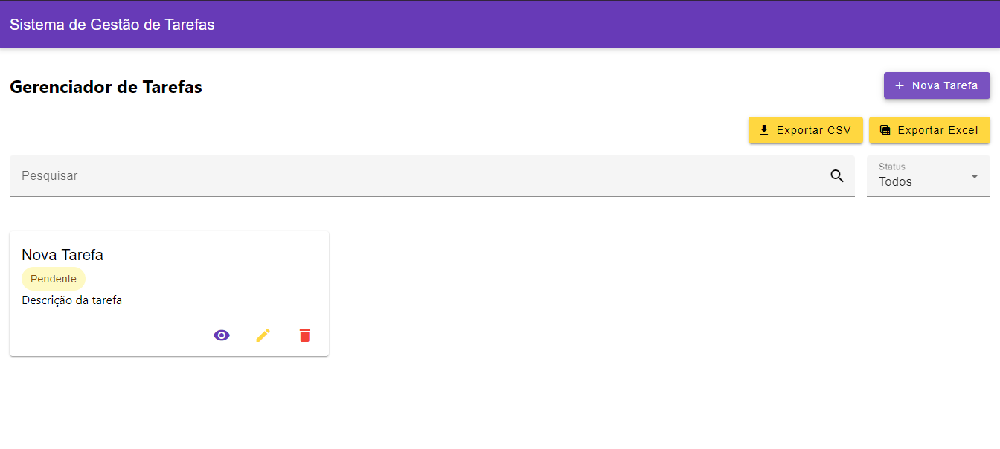
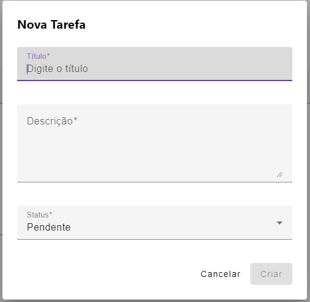
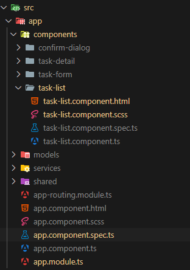

# Sistema de Gestão de Tarefas

[](https://jasmine.github.io/)
[](https://angular.io/)
[](https://material.angular.io/)
[](https://tailwindcss.com/)

Um sistema moderno e intuitivo para gerenciamento de tarefas, desenvolvido com Angular 16+, Material UI e TailwindCSS. O sistema permite aos usuários gerenciar suas tarefas diárias com funcionalidades avançadas de exportação e filtros.

## 📸 Screenshots

### Tela Principal


*Interface principal do sistema com lista de tarefas, filtros e opções de exportação*

### Formulário de Nova Tarefa


*Modal para criação de novas tarefas com campos para título, descrição e status*

### Testes Unitários


*22 specs executados com sucesso, garantindo a qualidade do código*

### Estrutura do Projeto


*Organização modular do projeto seguindo as melhores práticas do Angular*

## ✨ Funcionalidades

- ✅ Criar, visualizar, editar e remover tarefas
- 🔍 Busca e filtros por status
- 📊 Exportação de dados para CSV e Excel
- 🎨 Interface moderna com Material UI
- 📱 Design responsivo com TailwindCSS
- ✔️ Testes unitários completos

## 🚀 Tecnologias Utilizadas

- Angular 16+
- Angular Material
- TailwindCSS
- Jasmine (Testes Unitários)
- TypeScript

## 📋 Pré-requisitos

- Node.js (versão 14.x ou superior)
- npm (versão 6.x ou superior)
- Angular CLI (versão 16.x)

## 💻 Instalação

1. Clone o repositório:
```bash
git clone https://github.com/AndreDevFront/sistema-gestao-tarefas.git
```

2. Navegue até o diretório do projeto:
```bash
cd sistema-gestao-tarefas
```

3. Instale as dependências:
```bash
npm install
```

## 🎮 Como Executar

1. Para iniciar o servidor de desenvolvimento:
```bash
ng serve
```

2. Acesse a aplicação em seu navegador:
```
http://localhost:4200
```

## 🧪 Executando os Testes

Para executar os testes unitários:
```bash
ng test
```

## 📁 Estrutura do Projeto

```
src/
├── app/
│   ├── components/
│   │   ├── confirm-dialog/
│   │   ├── task-detail/
│   │   ├── task-form/
│   │   └── task-list/
│   ├── models/
│   ├── services/
│   └── shared/
├── assets/
└── styles/
```

## 🌟 Funcionalidades Detalhadas

### Gestão de Tarefas
- Adicionar novas tarefas com título, descrição e status
- Visualizar lista completa de tarefas
- Editar informações das tarefas existentes
- Remover tarefas

### Filtros e Busca
- Busca por texto em títulos e descrições
- Filtro por status de tarefa
- Busca case-insensitive

### Exportação de Dados
- Exportação para arquivo CSV
- Exportação para Excel
- Tratamento de erros durante exportação

### Componentes
- TaskListComponent: Gerenciamento e exibição da lista de tarefas
- NotificationService: Sistema de notificações para feedback ao usuário
- Testes unitários abrangentes para todos os componentes

## 🤝 Contribuindo

1. Faça um fork do projeto
2. Crie sua feature branch (`git checkout -b feature/AmazingFeature`)
3. Commit suas alterações (`git commit -m 'Add some AmazingFeature'`)
4. Push para a branch (`git push origin feature/AmazingFeature`)
5. Abra um Pull Request

## 📝 Licença

Este projeto está sob a licença MIT. Veja o arquivo [LICENSE](LICENSE) para mais detalhes.

## ✍️ Autor

André Luz da Silva - [dresch666@gmail.com](mailto:dresch666@gmail.com)

---

⌨️ com ❤️ por [AndreDevFront](https://github.com/AndreDevFront)
